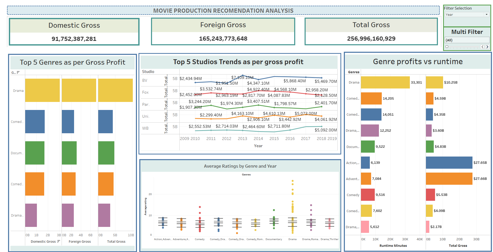
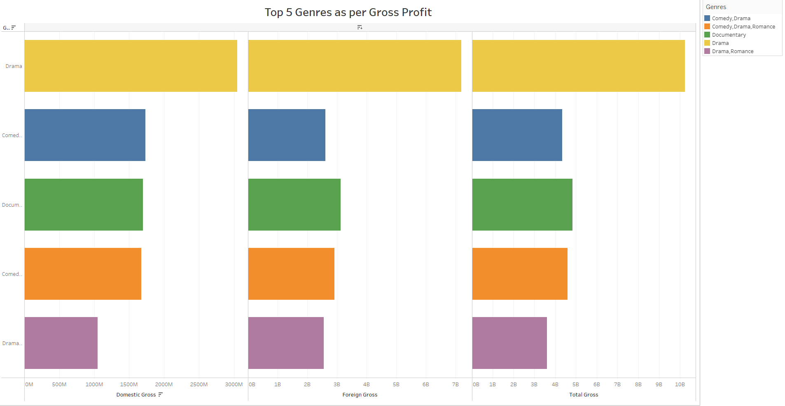
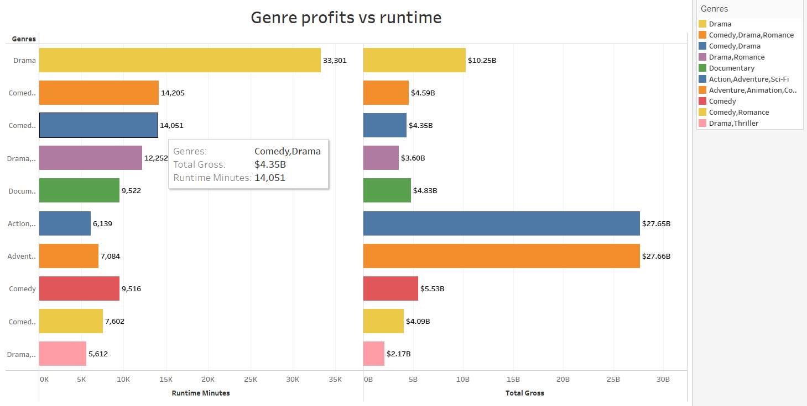
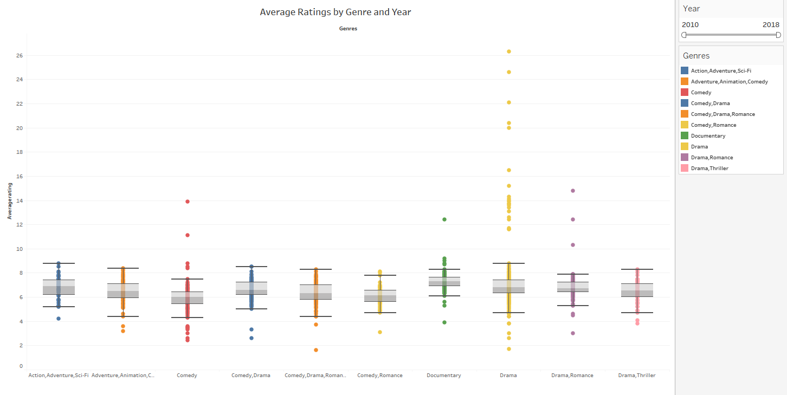

# Movie_Production_Analysis_Phase_2_Project
=============================

# Introduction
------------

Welcome to the Movie Studio Insights Project! This project aims to provide a comprehensive analysis of current box office trends to guide the strategic decisions for our new movie studio. By leveraging data from multiple sources, we aim to identify the types of films that are currently performing best at the box office and translate these findings into actionable insights.

# Objectives
----------

1. **Identify the Highest Grossing Films**: Determine which movies are leading in box office earnings.
2. **Determine the Most Common Genres Among Top-Grossing Movies**: Analyze the prevalent genres among the highest-grossing films.
3. **Analyze the Correlation Between Box Office Performance and Movie Ratings**: Investigate how movie ratings correlate with their box office success.
4. **Identify the Most Successful Film Studios**: Recognize the studios that produce the most successful films.

### Datasets Used
-------------

1.  **`im.db.zip`**: Zipped SQLite database containing `movie_basics` and `movie_ratings` tables.
2.  **`bom.movie_gross.csv.gz`**: Compressed CSV file with box office gross information.

Project Steps
-------------

### 1\. Data Extraction and Cleaning

*   **SQLite Database**:
    *   Extracted and cleaned data from `movie_basics` and `movie_ratings` tables.
    *   Dropped rows with null values in crucial columns like `original_title` and `genres`.
    *   Merged the tables on the `movie_id` column.
*   **CSV File**:
    *   Loaded and cleaned `bom.movie_gross.csv.gz`.
    *   Removed commas and converted the `foreign_gross` column to numeric.
    *   Filled missing values in `foreign_gross` with the median of the column.

### 2\. Data Merging

*   Merged the cleaned data from the SQLite database with the cleaned CSV data using the `title` and `year` columns.

### 3\. Calculated Columns

*   Created new columns like `total_gross` by summing `domestic_gross` and `foreign_gross`.
*   Condensed filters using parameters for a more user-friendly dashboard experience.

### 4\. Visualization and Analysis

*   Generated key visualizations to meet project objectives:
    1.  Bar charts  identify highest-grossing films.
    2.  line graphs to show trends 
    3. bar chart to show the studio production
    

### 5\. Dashboard Creation

*   Created an interactive dashboard in Tableau, including:
    *   Key Performance Indicators (KPIs).
    *   Dynamic filters using parameters.
    *   Interactive visualizations to explore data insights.

Dashboard Title
---------------

**Movie Production Recomendation Analysis**

Dashboard snapshot
-----------------

The dashboard entails analysis to give insights on the following:

1.  **Highest Grossing Films**: Identify the top-performing movies at the box office.
              
2.  **Popular Genres**: Uncover the most common genres among high-grossing films.
              
3.  **Performance and Ratings Correlation**: Analyze how box office success aligns with movie ratings.
              
4.  **Leading Film Studios**: Recognize the studios behind the most successful films.

Navigate through the visualizations to understand the market dynamics and inform our production strategies for creating compelling, high-grossing content.
### 6\. Recommendations
----------------------

1. **Proven Genres**
Insight: Certain genres consistently perform well at the box office.

Recommendation: Prioritize the production of films in high-performing genres such as Action, Adventure, and Animation. These genres have demonstrated strong box office returns and broad audience appeal.

2. **Successful Studio Collaborations**
Insight: Some film studios have a proven track record of producing high-grossing movies.

Recommendation: Form partnerships or collaborations with these successful studios. Leveraging their expertise can increase the likelihood of achieving box office success.

3. **Strong Ratings**
Insight: There is a positive correlation between movie ratings and box office performance.

Recommendation: Focus on creating high-quality content that garners positive ratings from critics and audiences. Invest in strong scripts, talented directors, and high production values to achieve this.

4. **International Market Focus**
Insight: Foreign gross revenue significantly contributes to total box office earnings.

Recommendation: Develop strategies to appeal to international audiences. Consider global market trends, incorporate diverse cultural elements, and invest in marketing campaigns tailored to different regions.

5. **Data-Driven Decisions**
Insight: Data is crucial for guiding strategic decisions.

Recommendation: Continuously collect and analyze data to inform decision-making processes. Implement data analytics tools and hire data analysts to monitor trends, evaluate performance, and adjust strategies accordingly.

6. **Marketing and Promotion**
Insight: Successful films often have robust marketing and promotional strategies.

Recommendation: Allocate sufficient budget for marketing and promotion to maximize visibility and attract a wide audience. Use social media, influencers, and traditional media channels to create buzz and drive interest.

7. **Experimentation with New Formats**
Insight: The film industry is evolving with new formats and distribution platforms.

Recommendation: Stay ahead by experimenting with new formats such as streaming services, virtual reality, and interactive content. This can help tap into emerging trends and reach new audiences.

Conclusion
----------

This project provides a solid foundation for understanding the current trends in the movie industry. By leveraging the insights gained from this analysis, our new movie studio can make informed decisions to produce content that resonates with audiences and achieves box office success.

Contact
-------

For any questions or further information, please contact \[Francis Muthoni\] at \[francislizmuthoni@gmail.com\].